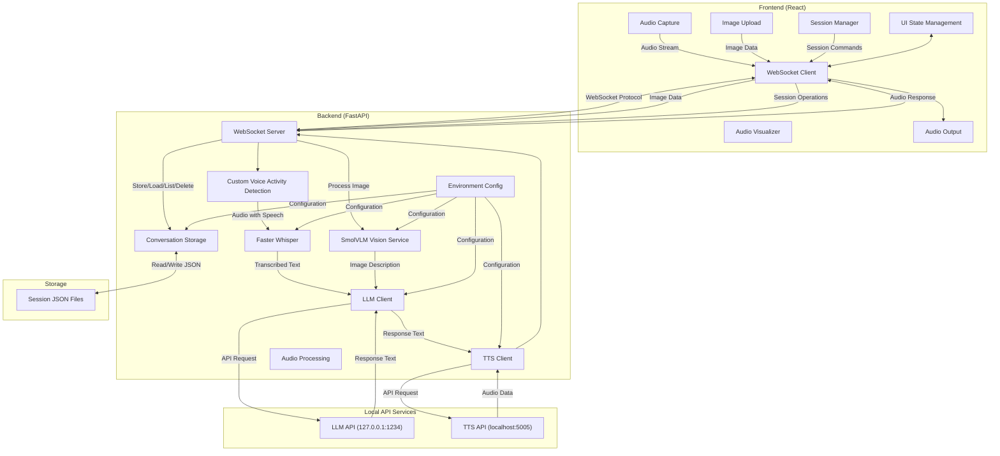
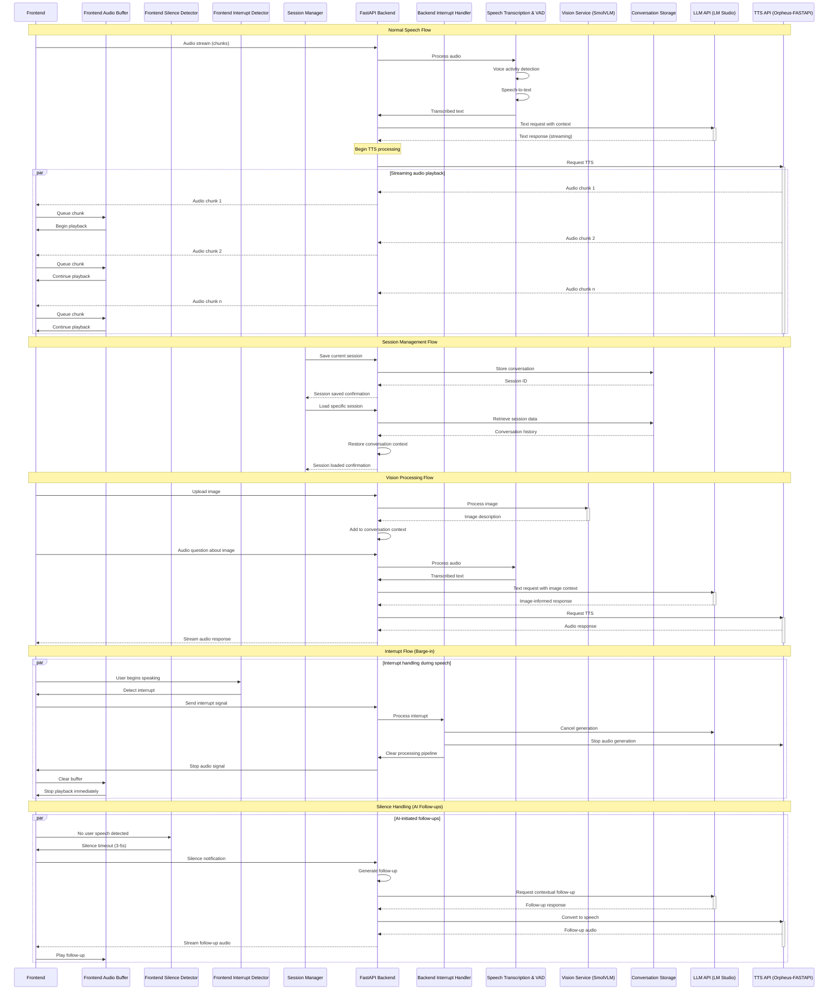

# Vocalis

[](https://opensource.org/licenses/Apache-2.0)
[](https://reactjs.org/)
[](https://fastapi.tiangolo.com/)
[](https://github.com/guillaumekln/faster-whisper)
[](https://www.python.org/)

A sophisticated AI assistant with speech-to-speech capabilities built on a modern React frontend with a FastAPI backend. Vocalis provides a responsive, low-latency conversational experience with advanced visual feedback.

## Video Demonstration of Setup and Usage

[](https://www.youtube.com/watch?v=2slWwsHTNIA)

## Changelog

**v1.5.0** (Vision Update) - April 12, 2025
- 🔍 New image analysis capability powered by [SmolVLM-256M-Instruct model](https://huggingface.co/HuggingFaceTB/SmolVLM-256M-Instruct)
- 🖼️ Seamless image upload and processing interface
- 🔄 Contextual conversation continuation based on image understanding
- 🧩 Multi-modal conversation support (text, speech, and images)
- 💾 Advanced session management for saving and retrieving conversations
- 🎨 Improved UI with central call button and cleaner control layout
- 🔌 Simplified sidebar without redundant controls

**v1.0.0** (Initial Release) - March 31, 2025
- ✨ Revolutionary barge-in technology for natural conversation flow
- 🔊 Ultra low-latency audio streaming with adaptive buffering
- 🤖 AI-initiated greetings and follow-ups for natural conversations
- 🎨 Dynamic visual feedback system with state-aware animations
- 🔄 Streaming TTS with chunk-based delivery for immediate responses
- 🚀 Cross-platform support with optimised setup scripts
- 💻 CUDA acceleration with fallback for CPU-only systems

## Features

### 🎯 Advanced Conversation Capabilities

- **🗣️ Barge-In Interruption** - Interrupt the AI mid-speech for a truly natural conversation experience
- **👋 AI-Initiated Greetings** - Assistant automatically welcomes users with a contextual greeting
- **💬 Intelligent Follow-Ups** - System detects silence and continues conversation with natural follow-up questions
- **🔄 Conversation Memory** - Maintains context throughout the conversation session
- **🧠 Contextual Understanding** - Processes conversation history for coherent, relevant responses
- **🖼️ Image Analysis** - Upload and discuss images with integrated visual understanding
- **💾 Session Management** - Save, load, and manage conversation sessions with customisable titles

### ⚡ Ultra-Responsive Performance

- **⏱️ Low-Latency Processing** - End-to-end latency under 500ms for immediate response perception
- **🔊 Streaming Audio** - Begin playback before full response is generated
- **📦 Adaptive Buffering** - Dynamically adjust audio buffer size based on network conditions
- **🔌 Efficient WebSocket Protocol** - Bidirectional real-time audio streaming
- **🔄 Parallel Processing** - Multi-stage pipeline for concurrent audio handling

### 🎨 Interactive Visual Experience

- **🔮 Dynamic Assistant Orb** - Visual representation with state-aware animations:
  - Pulsing glow during listening
  - Particle animations during processing
  - Wave-like motion during speaking
- **📝 Live Transcription** - Real-time display of recognised speech
- **🚦 Status Indicators** - Clear visual cues for system state
- **🌈 Smooth Transitions** - Fluid state changes with appealing animations
- **🌙 Dark Theme** - Eye-friendly interface with cosmic aesthetic

### 🛠️ Technical Excellence

- **🔍 High-Accuracy VAD** - Superior voice activity detection using custom-built VAD
- **🗣️ Optimised Whisper Integration** - Faster-Whisper for rapid transcription
- **🔊 Real-Time TTS** - Chunked audio delivery for immediate playback
- **🖥️ Hardware Flexibility** - CUDA acceleration with CPU fallback options
- **🔧 Easy Configuration** - Environment variables and user-friendly setup

## Quick Start

### Prerequisites

#### Windows
- Python 3.10+ installed and in your PATH
- Node.js and npm installed

#### macOS
- Python 3.10+ installed
- Install Homebrew (if not already installed):
  ```bash
  /bin/bash -c "$(curl -fsSL https://raw.githubusercontent.com/Homebrew/install/HEAD/install.sh)"
  ```
- Install Node.js and npm:
  ```bash
  brew install node
  ```
- **Apple Silicon (M1/M2/M3/M4) Notes**:
  - The setup will automatically install a compatible PyTorch version
  - If you encounter any PyTorch-related errors, you may need to manually install it:
    ```bash
    pip install torch
    ```
    Then continue with the regular setup.

### One-Click Setup (Recommended)

#### Windows
1. Run `setup.bat` to initialise the project (one-time setup)
   - Includes option for CUDA or CPU-only PyTorch installation
2. Run `run.bat` to start both frontend and backend servers
3. If you need to update dependencies later, use `install-deps.bat`

#### macOS/Linux
1. Make scripts executable: `chmod +x *.sh`
2. Run `./setup.sh` to initialise the project (one-time setup)
   - Includes option for CUDA or CPU-only PyTorch installation
3. Run `./run.sh` to start both frontend and backend servers
4. If you need to update dependencies later, use `./install-deps.sh`

### Manual Setup (Alternative)

If you prefer to set up the project manually, follow these steps:

#### Backend Setup
1. Create a Python virtual environment:
   ```bash
   cd backend
   python -m venv env
   # Windows:
   .\env\Scripts\activate
   # macOS/Linux:
   source env/bin/activate
   ```

2. Install the Python dependencies:
   ```bash
   pip install -r requirements.txt
   ```

3. If you need CUDA support, install PyTorch with CUDA:
   ```bash
   pip install torch torchvision torchaudio --index-url https://download.pytorch.org/whl/cu124
   ```

4. Start the backend server:
   ```bash
   python -m backend.main
   ```

#### Frontend Setup
1. Install Node.js dependencies:
   ```bash
   cd frontend
   npm install
   ```

2. Start the development server:
   ```bash
   npm run dev
   ```

### Personalising Vocalis

After launching Vocalis, you can customise your experience through the sidebar:

1. Click the sidebar icon to open the navigation panel
2. Under the "Settings" tab, click "Preferences" to access personalisation options

The preferences modal offers several ways to tailor Vocalis to your needs:

#### User Profile
- **Your Name**: Enter your name to personalise greetings and make conversations more natural
- This helps Vocalis address you properly during interactions

#### System Prompt
- Modify the AI's behaviour by editing the system prompt
- The default prompt is optimised for natural voice interaction, but you can customise it for specific use cases
- Use the "Restore Default" button to revert to the original prompt if needed

#### Vision Capabilities
- Toggle vision capabilities on/off using the switch at the bottom of the preferences panel
- When enabled, Vocalis can analyse images shared during conversations
- This feature allows for rich multi-modal interactions where you can discuss visual content

These settings are saved automatically and persist between sessions, ensuring a consistent experience tailored to your preferences.

## External Services

Vocalis is designed to work with OpenAI-compatible API endpoints for both LLM and TTS services:

- **LLM (Language Model)**: By default, the backend is configured to use [LM Studio](https://lmstudio.ai/) running locally. This provides a convenient way to run local language models compatible with OpenAI's API format.
  
  **Custom Vocalis Model**: For optimal performance, Vocalis includes a purpose-built fine-tuned model: [lex-au/Vocalis-Q4_K_M.gguf](https://huggingface.co/lex-au/Vocalis-Q4_K_M.gguf). This model is based on Meta's LLaMA 3 8B Instruct and specifically optimised for immersive conversational experiences with:
  - Enhanced spatial and temporal context tracking
  - Low-latency response generation
  - Rich, descriptive language capabilities
  - Efficient resource utilisation through Q4_K_M quantisation
  - Seamless integration with the Vocalis speech-to-speech pipeline

- **Text-to-Speech (TTS)**: For voice generation, the system works out of the box with:
  - [Orpheus-FASTAPI](https://github.com/Lex-au/Orpheus-FastAPI): A high-quality TTS server with OpenAI-compatible endpoints providing rich, expressive voices.
  
  You can adjust the endpoint in `.env` to any opensource TTS project. For a lightning-fast alternative:
  - [Kokoro-FastAPI](https://github.com/remsky/Kokoro-FastAPI): A lightning-fast TTS alternative, optimised for minimal latency when speed is the priority over maximum expressiveness.

Both services can be configured in the `backend/.env` file. The system requires these external services to function properly, as Vocalis acts as an orchestration layer combining speech recognition, language model inference, and speech synthesis.

## Visual Demo


## Session Management

Vocalis includes a robust session management system that allows users to save, load, and organise their conversations:

### Key Features

- **Save Conversations**: Save the current conversation state with a custom title
- **Load Previous Sessions**: Return to any saved conversation exactly as you left it
- **Edit Session Titles**: Rename sessions for better organisation
- **Delete Unwanted Sessions**: Remove conversations you no longer need
- **Session Metadata**: View additional information like message count
- **Automatic Timestamps**: Sessions track both creation and last update times

### Technical Implementation

The session system uses a two-part architecture:

1. **Backend Storage**:
   - Conversations are stored as JSON files in a dedicated directory
   - Each session maintains its complete message history
   - Asynchronous file I/O prevents performance impacts
   - UUID-based session identification ensures uniqueness

2. **Frontend Interface**:
   - Intuitive sidebar UI for session management
   - Real-time session status updates
   - Active session indicator
   - Session creation with optional custom titles

### Usage Flow

1. Start a new conversation with the assistant
2. Click "Save As New Conversation" to preserve the current state
3. Continue your conversation or load a different session
4. Return to any saved session at any time to continue where you left off
5. Edit session titles or delete unwanted sessions as needed

This persistent storage system ensures you never lose valuable conversations and can maintain separate contexts for different topics or projects.

## Architecture Overview



## Detailed System Architecture

The following diagram provides a comprehensive view of Vocalis's architecture, highlighting the advanced conversation features and interrupt handling systems that enable its natural conversational capabilities:

```mermaid
graph TD
    %% Client Side
    subgraph "Frontend (React + TypeScript + Vite)"
        FE_Audio[Audio Capture/Playback]
        FE_WebSocket[WebSocket Client]
        FE_UI[UI Components]
        FE_State[State Management]
        FE_InterruptDetector[Interrupt Detector]
        FE_SilenceDetector[Silence Detector]
        FE_ImageUpload[Image Upload Handler]
        FE_SessionUI[Session Manager UI]
        
        subgraph "UI Components"
            UI_Orb[AssistantOrb]
            UI_Stars[BackgroundStars] 
            UI_Chat[ChatInterface]
            UI_Prefs[PreferencesModal]
            UI_Sidebar[Sidebar]
            UI_Sessions[SessionManager]
        end
        
        subgraph "Services"
            FE_AudioService[Audio Service]
            FE_WebSocketService[WebSocket Service]
        end
    end
    
    %% Server Side
    subgraph "Backend (FastAPI + Python)"
        BE_Main[Main App]
        BE_Config[Configuration]
        BE_WebSocket[WebSocket Handler]
        BE_InterruptHandler[Interrupt Handler]
        BE_ConversationManager[Conversation Manager]
        
        subgraph "Services"
            BE_Transcription[Speech Transcription & VAD]
            BE_LLM[LLM Client]
            BE_TTS[TTS Client]
            BE_Vision[SmolVLM Vision Service]
            BE_Storage[Conversation Storage]
        end
        
        subgraph "Conversation Features"
            BE_GreetingSystem[AI Greeting System]
            BE_FollowUpSystem[Follow-Up Generator]
            BE_ContextMemory[Context Memory]
            BE_VisionContext[Image Context Manager]
            BE_SessionMgmt[Session Management]
        end
    end
    
    %% External Services & Storage
    subgraph "External Services"
        LLM_API[LM Studio OpenAI-compatible API]
        TTS_API[Orpheus-FASTAPI TTS]
    end
    
    subgraph "Persistent Storage"
        JSON_Files[Session JSON Files]
    end
    
    %% Data Flow - Main Path
    FE_Audio -->|Audio Stream| FE_AudioService
    FE_AudioService -->|Process Audio| FE_WebSocketService
    FE_WebSocketService -->|Binary Audio Data| FE_WebSocket
    FE_WebSocket <-->|WebSocket Protocol| BE_WebSocket
    
    BE_WebSocket -->|Audio Chunks| BE_Transcription
    BE_Transcription -->|Voice Activity Detection| BE_Transcription
    BE_Transcription -->|Transcribed Text| BE_ConversationManager
    BE_ConversationManager -->|Format Prompt| BE_LLM
    BE_LLM -->|API Request| LLM_API
    LLM_API -->|Response Text| BE_LLM
    BE_LLM -->|Response Text| BE_TTS
    BE_TTS -->|API Request| TTS_API
    TTS_API -->|Audio Data| BE_TTS
    BE_TTS -->|Processed Audio| BE_WebSocket
    
    BE_WebSocket -->|Audio Response| FE_WebSocket
    FE_WebSocket -->|Audio Data| FE_AudioService
    FE_AudioService -->|Playback| FE_Audio
    
    %% Session Management Flow
    FE_SessionUI -->|Save/Load/List/Delete| FE_WebSocketService
    FE_WebSocketService -->|Session Commands| FE_WebSocket
    FE_WebSocket -->|Session Operations| BE_WebSocket
    BE_WebSocket -->|Session Management| BE_SessionMgmt
    BE_SessionMgmt -->|Store/Retrieve| BE_Storage
    BE_Storage <-->|Persist Data| JSON_Files
    BE_Storage -->|Session Response| BE_WebSocket
    BE_WebSocket -->|Session Status| FE_WebSocket
    FE_WebSocket -->|Update UI| FE_SessionUI
    
    %% Vision Flow
    FE_ImageUpload -->|Image Data| FE_WebSocketService
    FE_WebSocketService -->|Image Base64| FE_WebSocket
    FE_WebSocket -->|Image Data| BE_WebSocket
    BE_WebSocket -->|Process Image| BE_Vision
    BE_Vision -->|Image Description| BE_VisionContext
    BE_VisionContext -->|Augmented Context| BE_ConversationManager
    
    %% Advanced Feature Paths
    
    %% 1. Interrupt System
    FE_Audio -->|Voice Activity| FE_InterruptDetector
    FE_InterruptDetector -->|Interrupt Signal| FE_WebSocket
    FE_WebSocket -->|Interrupt Command| BE_WebSocket
    BE_WebSocket -->|Cancel Processing| BE_InterruptHandler
    BE_InterruptHandler -.->|Stop Generation| BE_LLM
    BE_InterruptHandler -.->|Clear Buffer| BE_TTS
    BE_InterruptHandler -.->|Reset State| BE_ConversationManager
    
    %% 2. AI-Initiated Greetings
    BE_GreetingSystem -->|Initial Greeting| BE_ConversationManager
    BE_ConversationManager -->|Greeting Text| BE_LLM
    
    %% 3. Silence-based Follow-ups
    FE_SilenceDetector -->|Silence Detected| FE_WebSocket
    FE_WebSocket -->|Silence Notification| BE_WebSocket
    BE_WebSocket -->|Trigger Follow-up| BE_FollowUpSystem
    BE_FollowUpSystem -->|Generate Follow-up| BE_ConversationManager
    
    %% 4. Context Management
    BE_ConversationManager <-->|Store/Retrieve Context| BE_ContextMemory
    BE_SessionMgmt <-->|Save/Load Messages| BE_ContextMemory
    
    %% UI Interactions
    FE_State <-->|State Updates| FE_UI
    FE_WebSocketService -->|Connection Status| FE_State
    FE_AudioService -->|Audio Status| FE_State
    FE_InterruptDetector -->|Interrupt Status| FE_State
    FE_ImageUpload -->|Upload Status| FE_State
    
    %% Configuration
    BE_Config -->|Environment Settings| BE_Main
    BE_Config -->|API Settings| BE_LLM
    BE_Config -->|API Settings| BE_TTS
    BE_Config -->|Model Config| BE_Transcription
    BE_Config -->|Vision Settings| BE_Vision
    BE_Config -->|Storage Settings| BE_Storage
    BE_Config -->|Conversation Settings| BE_GreetingSystem
    BE_Config -->|Follow-up Settings| BE_FollowUpSystem
    
    %% UI Component Links
    FE_UI -->|Renders| UI_Orb
UI_Orb -->|Visualises States| FE_State
    FE_UI -->|Renders| UI_Stars
    FE_UI -->|Renders| UI_Chat
    UI_Chat -->|Displays Transcript| FE_State
    FE_UI -->|Renders| UI_Prefs
    FE_UI -->|Renders| UI_Sidebar
    FE_UI -->|Renders| UI_Sessions
    UI_Sessions -->|Manages Sessions| FE_SessionUI
    
    %% Technology Labels
    classDef frontend fill:#61DAFB,color:#000,stroke:#61DAFB
    classDef backend fill:#009688,color:#fff,stroke:#009688
    classDef external fill:#FF9800,color:#000,stroke:#FF9800
    classDef feature fill:#E91E63,color:#fff,stroke:#E91E63
    classDef storage fill:#9C27B0,color:#fff,stroke:#9C27B0
    
    class FE_Audio,FE_WebSocket,FE_UI,FE_State,FE_AudioService,FE_WebSocketService,UI_Orb,UI_Stars,UI_Chat,UI_Prefs,UI_Sidebar,FE_ImageUpload,FE_SessionUI,UI_Sessions frontend
    class BE_Main,BE_Config,BE_WebSocket,BE_Transcription,BE_LLM,BE_TTS,BE_Vision,BE_Storage backend
    class LLM_API,TTS_API external
    class FE_InterruptDetector,FE_SilenceDetector,BE_InterruptHandler,BE_GreetingSystem,BE_FollowUpSystem,BE_ConversationManager,BE_ContextMemory,BE_VisionContext,BE_SessionMgmt feature
    class JSON_Files storage
```



## Low-Latency TTS Streaming Architecture

For achieving true low-latency in the speech system, we implement streaming TTS with chunked delivery and barge-in capability:



### Image Analysis Process

Vocalis now includes visual understanding capabilities through the SmolVLM-256M-Instruct model:

1. **Image Upload**:
   - Users can click the vision button in the interface
   - A file picker allows selecting images up to 5MB
   - Images are encoded as base64 and sent to the backend

2. **Vision Processing**:
   - The SmolVLM model processes the image with transformers
   - The model generates a detailed description of the image contents
   - This description is added to the conversation context

3. **Contextual Continuation**:
   - After image processing, users can ask questions about the image
   - The system maintains awareness of the image context
   - Responses are generated with understanding of the visual content

4. **Multi-Modal Integration**:
   - The interface provides visual feedback during image processing
   - Transcripts and responses flow naturally between text and visual content
   - The conversation maintains coherence across modalities

### Streaming Architecture Features

1. **Parallel Processing**:
   - Simultaneous audio generation, transmission, and playback
   - Non-blocking pipeline for maximum responsiveness
   - Client-side buffer management with dynamic sizing

2. **Barge-in Capability**:
   - Real-time voice activity detection during AI speech
   - Multi-level interrupt system with priority handling
   - Immediate pipeline clearing for zero-latency response to interruptions

3. **Audio Buffer Management**:
   - Adaptive buffer sizes based on network conditions (20-50ms chunks)
   - Buffer health monitoring with automatic adjustments
   - Efficient audio format selection (Opus for compression, PCM for quality)

4. **Silence Response System**:
   - Time-based silence detection with configurable thresholds
   - Context-aware follow-up generation
   - Natural cadence for conversation flow maintenance

### Implementation Details:

1. **Backend TTS Integration**:
   - Configure TTS API with streaming support if available
   - Implement custom chunking if necessary

2. **Custom Streaming Implementation**:
   - Set up an async generator in FastAPI
   - Split audio into small chunks (10-50ms)
   - Send each chunk immediately through WebSocket

3. **WebSocket Protocol Enhancement**:
   - Add message types for different audio events:
     - `audio_chunk`: A piece of TTS audio to play immediately
     - `audio_start`: Signal to prepare audio context
     - `audio_end`: Signal that the complete utterance is finished

4. **Frontend Audio Handling**:
   - Use Web Audio API for low-latency playback
   - Implement buffer queue system for smooth playback

### Technical Considerations:

1. **Chunk Size Tuning**:
   - Find optimal balance between network overhead and latency

2. **Buffer Management**:
   - Avoid buffer underrun and excessive buffering

3. **Format Efficiency**:
   - Use efficient audio formats for streaming (Opus, WebM, or raw PCM)

4. **Abort Capability**:
   - Implement clean interruption for new user input

## Buffer Management Approach

### 1. Adaptive Buffer Sizing
- Start with small buffers (20-30ms)
- Monitor playback stability
- Dynamically adjust buffer size based on network conditions

### 2. Parallel Processing Pipeline
- Process audio in parallel streams where possible
- Begin TTS playback as soon as first chunk is available
- Continue processing subsequent chunks during playback

### 3. Interrupt Handling
- Implement a "barge-in" capability where new user speech cancels ongoing TTS
- Clear audio buffers immediately on interruption

## Latency Optimisation

Vocalis achieves exceptional low-latency performance through carefully optimised components:

### Speech Recognition Performance

The system uses Faster-Whisper with the `base.en` model and a beam size of 2, striking an optimal balance between accuracy and speed. This configuration achieves:

- **ASR Processing**: ~0.43 seconds for typical utterances
- **Response Generation**: ~0.18 seconds
- **Total Round-Trip Latency**: ~0.61 seconds

Real-world example from system logs:
```
INFO:faster_whisper:Processing audio with duration 00:02.229
INFO:backend.services.transcription:Transcription completed in 0.51s: Hi, how are you doing today?...
INFO:backend.services.tts:Sending TTS request with 147 characters of text
INFO:backend.services.tts:Received TTS response after 0.16s, size: 390102 bytes
```

### Customising Performance

You can adjust these settings to optimise for your specific needs:

1. **Model Size**: In `.env`, modify `WHISPER_MODEL=base.en` 
   - Options: tiny.en, base.en, small.en, medium.en, large
   - Smaller models = faster processing, potentially lower accuracy
   - Larger models = more accurate, but increased latency

2. **Beam Size**: In `backend/services/transcription.py`, modify the `beam_size` parameter
   - Default: 2
   - Range: 1-5 (1 = fastest, 5 = most accurate)
   - Located in the `__init__` method of the `WhisperTranscriber` class

### Latency vs. Accuracy Trade-offs

| Model | Beam Size | Approximate ASR Time | Accuracy |
|------|-----------|---------------------|----------|
| tiny.en | 1 | ~0.01s | Lower |
| base.en | 2 | ~0.03s | Good |
| small.en | 3 | ~0.10s | Better |
| medium.en | 4 | ~0.25s | Very Good |
| large | 5 | ~0.50s | Best |

With optimisations in place, Vocalis can achieve total processing latencies well under 250ms when using smaller models, which is typically perceived as "immediate" by users.

## Project Structure

```
Vocalis/
├── README.md
├── setup.bat            # Windows one-time setup script
├── run.bat              # Windows run script 
├── install-deps.bat     # Windows dependency update script
├── setup.sh             # Unix one-time setup script
├── run.sh               # Unix run script
├── install-deps.sh      # Unix dependency update script
├── conversations/       # Directory for saved session files
├── backend/
│   ├── .env
│   ├── main.py
│   ├── config.py
│   ├── requirements.txt
│   ├── services/
│   │   ├── __init__.py
│   │   ├── conversation_storage.py
│   │   ├── llm.py
│   │   ├── transcription.py  # Includes VAD functionality
│   │   ├── tts.py
│   │   ├── vision.py
│   ├── routes/
│   │   ├── __init__.py
│   │   ├── websocket.py
├── frontend/
│   ├── public/
│   ├── src/
│   │   ├── components/
│   │   │   ├── AssistantOrb.tsx
│   │   │   ├── BackgroundStars.tsx
│   │   │   ├── ChatInterface.tsx
│   │   │   ├── PreferencesModal.tsx
│   │   │   ├── SessionManager.tsx
│   │   │   ├── Sidebar.tsx
│   │   ├── services/
│   │   │   ├── audio.ts
│   │   │   ├── websocket.ts
│   │   ├── utils/
│   │   │   ├── hooks.ts
│   │   ├── App.tsx
│   │   ├── main.tsx
│   │   ├── index.css
│   │   ├── vite-env.d.ts
│   ├── package.json
│   ├── tsconfig.json
│   ├── tsconfig.node.json
│   ├── vite.config.ts
│   ├── tailwind.config.js
│   ├── postcss.config.js
```

## Dependencies

### Backend (Python)
```
fastapi==0.109.2
uvicorn==0.27.1
python-dotenv==1.0.1
websockets==12.0
numpy==1.26.4
transformers
faster-whisper==1.1.1
requests==2.31.0
python-multipart==0.0.9
torch==2.0.1
ctranslate2==3.10.0
ffmpeg-python==0.2.0
```

### Frontend
```
react
typescript
tailwindcss
lucide-react
websocket
web-audio-api
```

## Technical Decisions

- **Audio Format**: Web Audio API (44.1kHz, 16-bit PCM)
- **Browser Compatibility**: Targeting modern Chrome browsers
- **Error Handling**: Graceful degradation with user-friendly messages
- **Microphone Permissions**: Standard browser permission flow with clear guidance
- **Conversation Model**: Multi-turn with context preservation
- **State Management**: React hooks with custom state machine
- **Animation System**: CSS transitions with hardware acceleration
- **Vision Processing**: SmolVLM-256M-Instruct for efficient image understanding
- **Session Storage**: Asynchronous JSON file-based persistence with UUID identifiers

## License

This project is licensed under the Apache License 2.0 - see the LICENSE file for details.